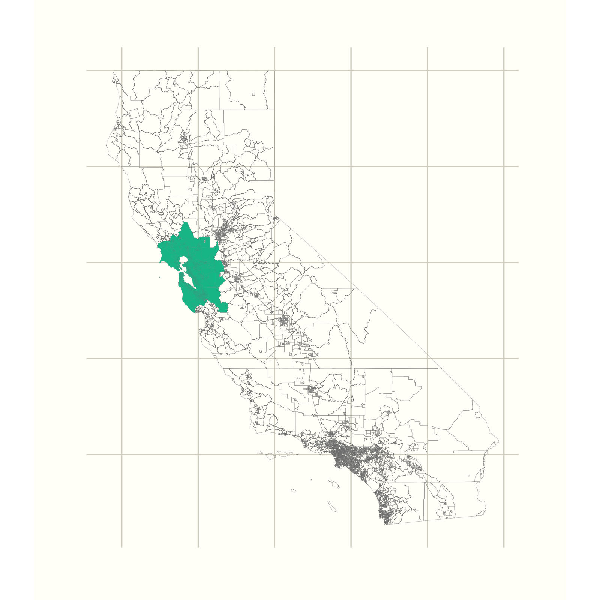

# haterzmapper

An `R` package for mapping diversity (ethnic, racial, linguistic or otherwise).

`haterzmapper` extends some of the functionality of the `sf` and `tidycensus` packages making it simple to subset simple feature data structures and gather census related data pertaining to specific geographies. It also provides some handy diversity functions (*ex*. *shannon index*).

#### Why is it called "haterzmapper"

This package is a product of my research, which involves understanding the geography of diversity and peoples' perceptions of other populations. This project is called `haterz` and, since this is a primarily geographic extension of that project, `haterzmapper` seemed most appropriate. 


## Example 

```splus
library(sf)
library(ggplot2)
library(haterzmapper)
library(tidycensus)


# gather census tracts of California from tidycensus
ca <- tidycensus::get_acs(geography = "tract", variables = "B00001_001",
                          state = "CA", geometry = TRUE)

# lat and lon of San Fran center
sflon <- topcities[topcities$full_name == "San Francisco, CA",]$lon 
sflat <- topcities[topcities$full_name == "San Francisco, CA",]$lat

# subset San Fran by 80 km radius
sf <- subset_map(ca, long = sflon, lat = sflat, dist = 80000)

# plot both layers
ggplot() +
  geom_sf(data = ca, colour = '#828282', fill = 'white', size = 0.05, alpha = 0) +
  geom_sf(data = sf, colour = '#828282', fill = '#00bf98', size = 0.001) +
  map_theme_stark()
```



```splus
library(haterzmapper)
library(ggplot2)
library(sf)
library(tidycensus)

# collect all census tracts from tidycensus
geographies <- reduce(
  map(us, function(x) {
    get_acs(geography = "tract", variables = 'B00001_001',
            state = x, geometry = TRUE, year = 2015)
  }),
  rbind
)


# water shapefile and subset it 
water <- st_read("~/Desktop/seattle_water.shp")
water <- subset_map(df = water, long = (topcities %>% filter(city == "Seattle"))$lon, lat = (topcities %>% filter(city == "Seattle"))$lat, 
                    dist = 50000)

# collect tracts from a 10km perimeter around the 40km radius
outer <- subset_map(df = geographies, long = (topcities %>% filter(city == "Seattle"))$lon, 
                    lat = (topcities %>% filter(city == "Seattle"))$lat, 
                    dist = 50000) 

# city data
city <- subset_map(df = joined, long = (topcities %>% filter(city == "Seattle"))$lon, 
                   lat = (topcities %>% filter(city == "Seattle"))$lat)


ggplot() +
  geom_sf(data = outer, color = '#e2e2de', fill = '#e2e2de', alpha = 0) + 
  geom_sf(data = city, aes(fill = factor(lab)) ,colour = '#ffffff', size = 0.01) +
  geom_sf(data = water, color = "#4f5a6b", fill = "#d2ddef", size = 0.15) +
  geom_sf(data = water, color = "#d2ddef", fill = "#d2ddef", size = 0.001) +
  map_theme_stark() +
  scale_color_manual(values = colors) +
  scale_fill_manual(values = colors) +
  ggtitle(label = "Seattle", subtitle = "Demographic Clusters") 

```
